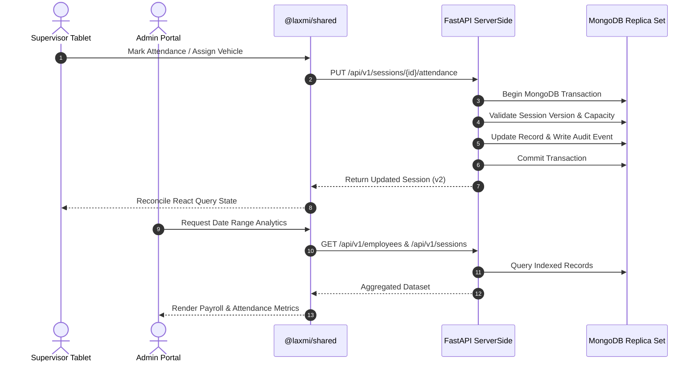

# Laxmi Enterprise — Monorepo Architecture

**Last Updated:** August 16, 2026  
**Architecture Version:** 3.0  
**Compliance Score:** 100/100 (Single Source of Truth, API-First, Shared Workspace Packages)

---

## 1. Executive Summary

Laxmi Enterprise operates a unified monorepo for daily workforce attendance tracking, vehicle fleet capacity management, trip and delivery lifecycle tracking, and administrative payroll analytics. 

The architecture enforces a strict **Single Source of Truth** pattern where the **FastAPI backend (`ServerSide`) and MongoDB** own all domain validation, transactions, audit logs, and data persistence. Frontend applications (`apps/supervisor` and `apps/admin`) operate as stateless presentation layers communicating solely via the versioned `/api/v1` REST contract. Common components, React Query hooks, and API services are centralized in `@laxmi/shared`.

---

## 2. Directory Layout

```
LaxmiEnterprise/
├── apps/
│   ├── supervisor/               # Touch-first tablet application for supervisors (Port 5173)
│   │   ├── src/
│   │   │   ├── components/       # Table, modals (TripTracker, ArrivedTime, Capacity, RequestEmployee)
│   │   │   ├── hooks/            # Local UI & attendance workflow state
│   │   │   ├── services/         # Offline queue & local PDF renderer
│   │   │   └── App.jsx
│   │   ├── Dockerfile
│   │   └── package.json
│   │
│   └── admin/                    # Administrative analytics & oversight portal (Port 5174)
│       ├── src/
│       │   ├── App.jsx           # Payroll calculations, date range filter, approvals, unlock
│       │   └── App.css
│       ├── Dockerfile
│       └── package.json
│
├── packages/
│   └── shared/                   # Core shared library (@laxmi/shared)
│       ├── components/           # ArrivedTimeModal, ErrorBoundary, LoadingSpinner
│       ├── hooks/                # useEmployees, useVehicles, useTrips, useAttendanceState
│       ├── services/             # backendApi, authService, restSession, restTrip, restAssignment
│       ├── types/                # api.ts (Auto-generated TypeScript types from OpenAPI)
│       ├── tests/                # Unit & edge case test suites (Mocha + Chai + Babel)
│       ├── check-types.js        # Type drift validation script
│       └── package.json
│
├── ServerSide/                   # Authoritative FastAPI backend service (Port 8000)
│   ├── app/
│   │   ├── api/v1/               # Routes: auth, employees, sessions, attendance, assignments, trips, pay
│   │   ├── core/                 # Config, JWT auth, exceptions, logging, middleware
│   │   ├── db/                   # MongoDB motor connection & index definitions
│   │   ├── models/               # Pydantic schemas: Employee, Vehicle, Session, Attendance, Trip, User
│   │   └── services/             # TripService, business domain rules
│   ├── scripts/                  # seed_data.py, export_openapi.py, sync.py
│   ├── tests/                    # Pytest test suite (assignments, attendance, auth, trips, sessions)
│   ├── Dockerfile
│   ├── openapi.json              # Published OpenAPI v3.1 specification
│   └── requirements.txt
│
├── Marker-CS-Extractor/          # Python PDF invoice and data extractor utility
├── docker-compose.yml            # Multi-container orchestration (MongoDB, Backend, Supervisor, Admin)
├── launch-containers.bat         # Single-click container launcher
├── TODO.md                       # Roadmap & task tracking
├── GOALS.md                      # Product & engineering milestones
├── MASTER INSTRUCTIONS.md        # Monorepo boundary rules
└── WORKFLOW_PLAN.md              # Phased engineering roadmap
```

---

## 3. Core System Subsystems

### 3.1. Authoritative Backend (`ServerSide/`)
- **FastAPI 0.115+ with Async MongoDB (Motor)**:
  - Atomic multi-document mutations using MongoDB transactions.
  - Optimistic concurrency control via `attendance_sessions.version` (returns `409 Conflict` on race conditions).
  - Role-based authorization (`admin`, `supervisor`).
  - Immutable audit logs (`audit_events` collection) for every mutation.
- **REST Endpoints (`/api/v1`)**:
  - `/auth`: Login, current user verification (`me`), token management.
  - `/sessions`: Session creation, loading, idempotent finalization (`finalize`), and admin unlock (`unlock`).
  - `/attendance`: Per-employee attendance marking (`on_time`, `arrived`, `absent`).
  - `/assignments`: Vehicle capacity validation and assignment mutations.
  - `/trips`: Vehicle dispatch, site arrival, product delivery, and return tracking.
  - `/employees`: Employee master CRUD, extra labour creation, and supervisor addition approvals.
  - `/vehicles`: Fleet master status, capacity limits, and utilization metrics.

### 3.2. Shared Workspace Package (`packages/shared/`)
- Exported under `@laxmi/shared` as a local workspace dependency.
- **Services**:
  - `backendApi`: Resilient HTTP client with automatic JWT token injection, unified error parsing, and retry handling.
  - `authService`: Token persistence and user session management.
  - `restSessionService`, `restEmployeeService`, `restVehicleService`, `restAssignmentService`, `restTripService`.
- **Custom React Query Hooks**:
  - Cached, synchronized queries (`useEmployees`, `useVehicles`, `useTrips`).
  - Optimistic mutations (`useCreateTrip`, `useUpdateTripStatus`, `useApproveEmployee`, `useRejectEmployee`, `useUpdateEmployee`, `useDeleteEmployee`).
- **Shared UI Components**:
  - `ArrivedTimeModal`: Precise touch-friendly arrival time picker.
  - `ErrorBoundary`: Graceful UI crash containment with recovery prompts.
  - `LoadingSpinner`: Standardized accessible loader.

### 3.3. Supervisor Tablet App (`apps/supervisor/`)
- **Design Philosophy**: Touch-first, spreadsheet-style layout tailored for landscape tablets.
- **Key Capabilities**:
  - Real-time search, category tabs (Workers, Drivers, Chalan Men, Extra Labour, Office, Vehicles), and alphabet range chips.
  - Fast attendance recording (instant submission for On Time / Absent, modal for Arrived).
  - Vehicle capacity enforcement with color-coded utilization bars (max 1 Driver, 1 Chalan Man, 6 Workers, 8 total).
  - **Trip & Task Completion**: `TripTrackerModal` tracks vehicle dispatch, site arrival, material delivery, and return.
  - **Workforce Requests**: `RequestEmployeeModal` sends employee addition requests for admin approval.
  - Offline mutation queue with background synchronization.
  - Client-side PDF generation for attendance sheets and vehicle utilization.

### 3.4. Admin Analytics Portal (`apps/admin/`)
- **Key Capabilities**:
  - **Payroll Engine**: Automated base wage and overtime calculation with category rate presets.
  - **Date Range Filtering**: Analyze historical attendance across custom date ranges or presets (7d, 30d).
  - **Employee Approval Center**: Review, approve, reject, edit, or delete supervisor-requested workers.
  - **Session Unlock Control**: Reset finalized sessions back to in-progress when administrative corrections are needed.
  - **Fleet & Trip Oversight**: Real-time vehicle utilization and trip status monitoring.
  - **CSV Exports**: One-click exports for payroll, attendance, and vehicle status reports.

---

## 4. Data Flow Architecture



---

## 5. Type Synchronization Pipeline

To guarantee complete type safety without manual duplication:
1. Backend models in `ServerSide/app/models/*.py` define the source of truth.
2. `ServerSide/scripts/export_openapi.py` exports `openapi.json` without requiring a running server.
3. `packages/shared/types/api.ts` is auto-generated via `openapi-typescript`.
4. Git pre-commit hooks verify that TypeScript types match OpenAPI specifications on every backend commit.

---

## 6. Docker & Deployment

All services run inside isolated Docker containers connected via `laxmi-network`:
- **MongoDB**: `localhost:27017` (data persisted in `mongodb_data` volume)
- **FastAPI Backend**: `http://localhost:8000` (docs at `http://localhost:8000/docs`)
- **Supervisor App**: `http://localhost:5173`
- **Admin Portal**: `http://localhost:5174`

Start all containers in development:
```bash
.\launch-containers.bat
# or
docker-compose up --build
```
