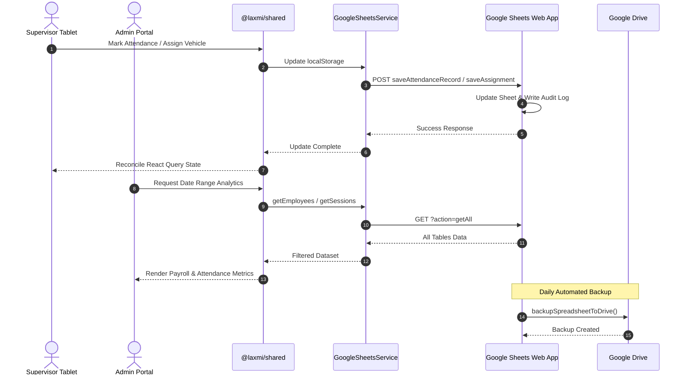

# Laxmi Enterprise — Monorepo Architecture

**Last Updated:** September 2, 2026  
**Architecture Version:** 4.0 (Google Sheets-Only)  
**Compliance Score:** 100/100 (Serverless, Google Sheets Database, Google Drive Storage, GitHub Pages Hosted)

---

## 1. Executive Summary

Laxmi Enterprise operates a unified monorepo for daily workforce attendance tracking, vehicle fleet capacity management, trip and delivery lifecycle tracking, and administrative payroll analytics. 

The architecture enforces a **100% Serverless, Google Sheets-First** pattern where **Google Sheets and Google Drive** serve as the single source of truth for all data storage, retrieval, and backup operations. Frontend applications (`apps/supervisor` and `apps/admin`) operate as stateless presentation layers communicating directly with Google Sheets via Google Apps Script Web App API. Common components, React Query hooks, and API services are centralized in `@laxmi/shared`.

---

## 2. Directory Layout

```
LaxmiEnterprise/
├── apps/
│   ├── supervisor/               # Touch-first tablet application for supervisors (Port 5173)
│   │   ├── src/
│   │   │   ├── components/       # Table, modals (TripTracker, ArrivedTime, Capacity, RequestEmployee)
│   │   │   ├── hooks/            # Local UI & attendance workflow state
│   │   │   ├── services/         # Offline queue & local PDF renderer
│   │   │   └── App.jsx
│   │   ├── Dockerfile
│   │   └── package.json
│   │
│   └── admin/                    # Administrative analytics & oversight portal (Port 5174)
│       ├── src/
│       │   ├── App.jsx           # Payroll calculations, date range filter, approvals, unlock
│       │   └── App.css
│       ├── Dockerfile
│       └── package.json
│
├── packages/
│   └── shared/                   # Core shared library (@laxmi/shared)
│       ├── components/           # ArrivedTimeModal, ErrorBoundary, LoadingSpinner
│       ├── hooks/                # useEmployees, useVehicles, useTrips, useAttendanceState
│       ├── services/             # googleSheetsService, authService, restSession, restTrip, restAssignment
│       ├── types/                # TypeScript contracts
│       ├── tests/                # Unit & edge case test suites (Mocha + Chai + Babel)
│       └── package.json
│
├── google-sheets/                # Google Apps Script Web App & Database Schema
│   ├── Code.gs                   # Complete Google Sheets API & Drive automation
│   ├── SHEET_STRUCTURE.md        # Data schema documentation
│   ├── BEST_PRACTICES.md         # Google Sheets usage guidelines
│   └── README.md                 # Setup instructions
│
├── Marker-CS-Extractor/          # Python PDF invoice and data extractor utility
├── TODO.md                       # Roadmap & task tracking
├── GOALS.md                      # Product & engineering milestones
├── MASTER INSTRUCTIONS.md        # Monorepo boundary rules
└── WORKFLOW_PLAN.md              # Phased engineering roadmap
```

---

## 3. Core System Subsystems

### 3.1. Google Sheets Database Engine (`google-sheets/`)
- **Google Apps Script Web App**:
  - Complete JSON REST API (`doGet`/`doPost`) for frontend communication
  - 9 structured worksheets: `Employees`, `Vehicles`, `Contractors`, `Rates_Config`, `Users_Roles`, `Attendance_Sessions`, `Attendance_Records`, `Vehicle_Assignments`, `Vehicle_Trips`, `Daily_Payroll`, `Audit_Logs`
  - Automated Google Drive folder management (`Vision Loop - Laxmi Enterprise` root with subfolders)
  - Daily automated backups to `02_Daily_Attendance_Backups`
  - Role-based access control via Gmail authentication
- **REST API Endpoints**:
  - `GET ?action=ping` - Health check
  - `GET ?action=getAll` - Fetch all tables
  - `GET ?action=checkRole&email=...` - Role verification
  - `GET ?action=getTable&table=...` - Fetch specific table
  - `POST` actions: `saveEmployee`, `bulkSaveEmployees`, `deleteEmployee`, `saveUser`, `deleteUser`, `saveVehicle`, `saveSession`, `saveAttendanceRecord`, `saveAssignment`, `deleteAssignment`, `saveTrip`, `savePayroll`, `bulkUploadAll`, `uploadReportToDrive`

### 3.2. Shared Workspace Package (`packages/shared/`)
- Exported under `@laxmi/shared` as a local workspace dependency with dual ESM/CommonJS module support.
- **Services**:
  - `googleSheetsService`: Direct Google Sheets API communication with localStorage fallback and auto-sync
  - `authService`: Gmail-based role verification and session management
  - Local offline queue with background synchronization
- **Custom React Query Hooks**:
  - Cached, synchronized queries (`useEmployees`, `useVehicles`, `useTrips`) with fine-tuned caching (`staleTime: 5m/3m/30s`, `gcTime: 10m/5m`).
  - Optimistic mutations (`useCreateTrip`, `useUpdateTripStatus`, `useApproveEmployee`, `useRejectEmployee`, `useUpdateEmployee`, `useDeleteEmployee`, `useBulkUpdateCompensation`).
  - `usePerformanceMonitor`: Component render tracking, slow render logging (>16ms), async duration profiling (`measureAsync`), and performance marks.
- **Shared UI Components**:
  - `ArrivedTimeModal`: Precise touch-friendly arrival time picker.
  - `ErrorBoundary`: Graceful UI crash containment with recovery prompts.
  - `LoadingSpinner`: Standardized accessible loader.
- **Core Utilities**:
  - `requestId`: Unique request ID generation (`REQ-<timestamp>-<rand>`) and lifecycle tracking.
  - `logger`: Structured JSON logging with configurable log levels (`DEBUG`, `INFO`, `WARN`, `ERROR`) and sensitive field scrubbing.
  - `security`: XSS escaping, CSRF token generation, and `RateLimiter` class.
  - `config`: Centralized configuration constants and environment management.

### 3.3. Supervisor Tablet App (`apps/supervisor/`)
- **Design Philosophy**: Touch-first, spreadsheet-style layout tailored for landscape tablets.
- **Performance & Code Splitting**: Heavy modal components (`TripTrackerModal`, `CapacityConflictModal`, `CapacityReportModal`, `VehicleAssignmentHistory`, `RequestEmployeeModal`) are lazily loaded with scoped `<Suspense>` boundaries.
- **Key Capabilities**:
  - Real-time search, category tabs (Workers, Drivers, Chalan Men, Extra Labour, Office, Vehicles) with accurate dynamic counts (`Vehicles (25)`), and alphabet range chips.
  - Fast attendance recording (instant submission for On Time / Absent, modal for Arrived).
  - Vehicle capacity enforcement with color-coded utilization bars (max 1 Driver, 1 Chalan Man, 6 Workers, 8 total).
  - **Trip & Task Completion**: `TripTrackerModal` tracks vehicle dispatch, site arrival, material delivery, and return.
  - **Workforce Requests**: `RequestEmployeeModal` sends employee addition requests for admin approval.
  - Offline mutation queue with background synchronization.
  - Client-side PDF generation for attendance sheets and vehicle utilization.

### 3.4. Admin Analytics Portal (`apps/admin/`)
- **Architecture**: Wrapped with root `QueryClientProvider` and `ErrorBoundary` in `main.jsx` for resilient state management and authentication error handling.
- **Key Capabilities**:
  - **Payroll Engine**: Automated base wage and overtime calculation with category rate presets.
  - **Bulk Wage Editor**: Batch wage updates across employee categories and CSV upload parsing.
  - **Contractor Settlements**: Real-time aggregation of attendance, base wages, extra hours, and incentives grouped by labour contractor.
  - **Date Range Filtering**: Analyze historical attendance across custom date ranges or presets (7d, 30d).
  - **Employee Approval Center**: Review, approve, reject, edit, or delete supervisor-requested workers.
  - **Session Unlock Control**: Reset finalized sessions back to in-progress when administrative corrections are needed.
  - **Fleet & Trip Oversight**: Real-time vehicle utilization and trip status monitoring.
  - **CSV Exports**: One-click exports for payroll, contractor settlements, attendance, and vehicle status reports.

---

## 4. Data Flow Architecture



---

## 5. Google Sheets Setup & Deployment

### Google Sheets Initial Setup
1. Open [sheets.new](https://sheets.new) and create a new spreadsheet
2. Go to **Extensions** > **Apps Script**
3. Copy & paste the contents of [`google-sheets/Code.gs`](./google-sheets/Code.gs)
4. Run the function **`setupLaxmiEnterpriseSystem`** once to create all sheets, format headers, and generate Google Drive folders
5. Click **Deploy** > **New deployment** > **Web app** > Access: **Anyone** > Copy the **Web App URL**
6. Configure the Web App URL in the Admin portal's Google Sheets Sync Center

### Google Drive Folder Structure
The system automatically creates the following folder hierarchy in your Google Drive:
- **Vision Loop - Laxmi Enterprise/** (Root)
  - **01_Live_Database/** - Master spreadsheet with Apps Script Web App
  - **02_Daily_Attendance_Backups/** - Daily timestamped spreadsheet backups
  - **03_Monthly_Payroll_Reports/** - Monthly payroll summaries and reports
  - **04_Supervisor_PDF_Exports/** - PDF attendance sheets and vehicle reports
  - **05_Contractor_Settlements/** - Contractor billing and settlement documents

### Local Development
```bash
# Run Supervisor App (Port 5173)
npm run dev:supervisor

# Run Admin Portal (Port 5174)
npm run dev:admin

# Build for GitHub Pages
npm run build:pages
```

### GitHub Pages Deployment
Every commit pushed to `master` automatically triggers the GitHub Actions workflow [`.github/workflows/deploy-pages.yml`](./.github/workflows/deploy-pages.yml), building the unified static bundle and publishing it live to **`https://visionloop-org.github.io/LaxmiEnterprise/`**.

