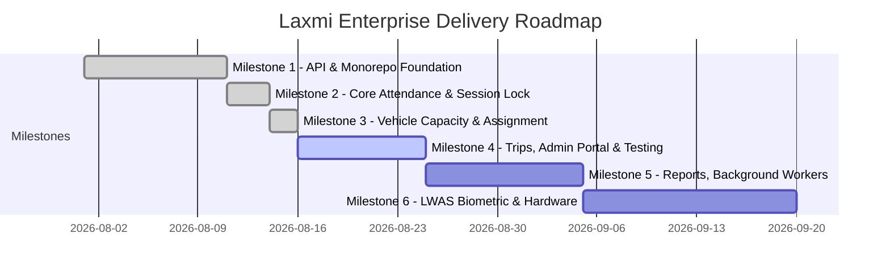

# Laxmi Enterprise Goals & Milestones

**Last Updated:** August 16, 2026  
**Status:** Milestones 1–3 Complete, Milestone 4 In Progress, Milestone 5 Roadmapped

---

## 1. Product Goal

Deliver a resilient, high-speed attendance, fleet capacity, vehicle trip lifecycle, and payroll intelligence platform for Laxmi Enterprise's daily workforce of 120–150+ workers across quarry, yard, transport, and office operations.

---

## 2. Architecture Goals

1. **Single Source of Truth**: Centralize all business rules, transactions, capacity constraints, and audit trails in the FastAPI backend and MongoDB replica set.
2. **API-First Monorepo**: Keep web apps (`apps/supervisor`, `apps/admin`), Python automation scripts, and future mobile/kiosk clients strictly decoupled consumers of the versioned `/api/v1` contract.
3. **No Direct DB Access**: Frontend applications and external scripts must never connect directly to MongoDB.
4. **Code Reuse via Workspace Packages**: Centralize common React Query hooks, API transports, UI utilities, and TypeScript types in `@laxmi/shared`.
5. **Continuous Type Synchronization**: Automatically generate and validate frontend TypeScript contracts from the backend OpenAPI schema.

---

## 3. Attendance Goals

1. **Daily Session Isolation**: Create exactly one attendance session per date and shift (e.g. `SES-2026-08-16-Shift A`).
2. **Deterministic Statuses**: Record each employee once per session as **On Time**, **Arrived** (with mandatory arrival time), or **Absent**.
3. **Optimistic & Fast Entry**: Allow supervisors to mark attendance rapidly with immediate tactile feedback, reconciling with the backend asynchronously.
4. **Audited Finalization & Locking**: Finalize sessions via the backend to lock further edits. Support emergency unlocks exclusively through authenticated Admin approval with full audit logs.
5. **Immutable Audit Trail**: Record actor, timestamp, previous value, and new value for every attendance transition.

---

## 4. Vehicle Capacity & Assignment Goals

1. **Present-Only Assignments**: Permit vehicle assignment only to employees marked present (`on_time` or `arrived`) in the active session.
2. **Strict Server-Side Capacity Enforcement**:
   - Max 1 Driver per vehicle
   - Max 1 Chalan Man per vehicle
   - Max 6 Workers / Extra Labour per vehicle
   - Max 8 total employees per vehicle
3. **Atomic Reassignment & Unassignment**: Handle assignment transfers between vehicles inside MongoDB transactions to prevent duplicate or phantom seats.
4. **Conflict Resolution**: Return structured capacity violation details enabling supervisors to resolve conflicts directly in the UI.

---

## 5. Vehicle Trip & Task Completion Lifecycle Goals

1. **End-to-End Delivery Tracking**: Track vehicle tasks through their complete lifecycle:
   - **Dispatched**: Vehicle departs yard/quarry with driver and material load.
   - **Reached Location**: Vehicle arrives at the designated customer site or unloading zone.
   - **Delivered Product**: Material / aggregate delivery is completed and verified.
   - **Returned / Completed**: Vehicle returns to base and becomes available for new dispatch.
2. **Timeline History**: Record every milestone event with timestamp, acting user, and optional site remarks.
3. **Operational Visibility**: Display active trips in real time on both supervisor tablets and the admin portal.

---

## 6. Administrative & Payroll Intelligence Goals

1. **Date Range Analytics**: Provide flexible date range filters (Today, 7 Days, 30 Days, Custom Range) for attendance and fleet trends.
2. **Automated Payroll Engine**: Compute daily base wage and overtime / extra duty compensation dynamically according to category wage presets.
3. **Supervisor Request Governance**: Enable supervisors to submit employee addition requests while restricting final approval to authorized administrators.
4. **Instant Data Portability**: Provide robust CSV exports for employee payroll, attendance summaries, and fleet utilization.

---

## 7. Reliability & Quality Goals

1. **Transactional Integrity**: All multi-document mutations execute within MongoDB ACID transactions.
2. **Optimistic Concurrency**: Prevent concurrent edit overwrite with `session.version` checks returning `409 Conflict`.
3. **Automated Test Coverage**:
   - Backend: Comprehensive pytest suites for auth, employees, sessions, attendance, assignments, trips, and error handling.
   - Frontend/Shared: Mocha/Chai unit and edge case suites for services, hooks, and shared components.
4. **Offline Resilience**: Queue supervisor mutations in `localStorage` when network connectivity drops, syncing automatically upon reconnection.

---

## 8. Delivery Milestones

### Milestone 1 — API & Monorepo Foundation ✅
- FastAPI backend, MongoDB setup, JWT authentication, OpenAPI schema, shared workspace package `@laxmi/shared`.

### Milestone 2 — Core Attendance & Locking ✅
- Attendance recording (`on_time`, `arrived`, `absent`), audit logging, optimistic concurrency, idempotent finalization.

### Milestone 3 — Vehicle Capacity & Assignment Engine ✅
- Domain capacity validation, transaction-safe vehicle assignments, conflict modals, supervisor tablet UI.

### Milestone 4 — Trips, Admin Analytics & Quality Suite ✅
- Vehicle trip dispatch and task completion lifecycle (`dispatched` → `reached_location` → `delivered` → `returned`).
- Admin portal with date filtering, payroll computation, contractor settlements, bulk wage editor, supervisor request approvals, and session unlocking.
- React Query v5 optimizations (`staleTime`, `gcTime`, error handlers), structured JSON logging, request tracing, and performance profiling.
- Comprehensive backend (pytest) and frontend (45 passing unit/hook tests) quality test suites.

### Milestone 5 — Server Reports & Background Workers 🔮 (Upcoming)
- Redis and Python background worker for asynchronous report generation.
- Server-side ReportLab PDF generator from persisted MongoDB session data.
- WebSocket / Server-Sent Events for real-time dashboard synchronization.

### Milestone 6 — Hardware & Biometric Turnstile Integration (LWAS) 🔮 (Roadmapped)
- USB QR scanner listener for worker ID gate entry.
- Turnstile rotation sensor event processing and thermal token printing.
- Future biometric (fingerprint/face recognition) evaluation.

